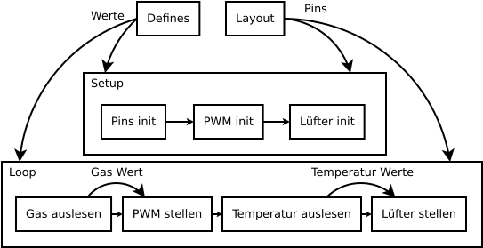

# Motorsteuerung

Das Programm ist in 2 Teile aufgeteilt:
- `Setup`: Dient zur Initialisierung des Arduino und der verschiedenen Komponenten.
- `Loop`: Dient zur Steuerung und zum Auslesen der Komponenten während der Laufzeit.

Die beiden Prozesse erhalten ihre Daten von `Defines` und `Layout`. `Defines` bestimmt, wie das Programm abläuft und `Layout` bestimmt, wie das Programm auf den verwendeten Mikrocontroller zugreift.

## Defines
`Defines` wird zur Konfiguration des Programms verwendet. Es enthält die folgenden Konstanten:
|Variable Name|Beschreibung|
|---|---|
|FAN_STATES|Die Temperatur als Analogwert, wobei das Programm zwischen verschiedenen Temperaturwerten wechselt.|
|FAN_POWER|Gibt die maximale und halbe Stärke der Lüfter an.| 
|SWITCH_LAG|Die Pause zwischen dem Umschalten auf die anderen Lüfterzustände.|
|MIN_CHARGE|Die Mindestladung in der Batterie für ein noch funktionierendes System.|

## Layout
Layout definiert das Layout und den Typ des Mikrocontrollers. Die Pins von `Layout` werden verwendet, damit das Programm den Mikrocontroller steuern kann.

## Setup
`Setup` wird beim Programmstart aufgerufen. Das Folgende wird initialisiert:
- Pins: Die durch `Layout` definierten Pins werden initialisiert.
- PWM: Das Programm setzt einen Timer, um hohe PWM-Frequenzen zu erzeugen.
- Lüfter: Zu Beginn des Programms werden alle Lüfter mit minimaler `FAN_STATES` aktiviert.

## Loop
`Loop` wird zur Laufzeit wiederholt aufgerufen. Sie behandelt alle Eingangsschnittstellen und Ausgangsschnittstellen.
- Die folgende Werte werden von den Komponenten ausgelesen.
    - Der analog Signal vom Gas Potentiometer.
    - Die analog Signale vom Temperatur Sensoren.
    - Die jetzige Ladung vom Akku.
- Bevor die Werte verarbeitet werden, werden sie zu der Console gesendet. In der Zukunft wird die möglichkeit bestehen sie auf ein Bildschirm zu sehen.
- Die Werte werden noch geprüft ob sie möglich sind. Bei unmöglichen Werten wird das jeweilige Komponente als beschädigt angezeigt.
- Das Programm kann 2 Stände haben. Ein Zustand beschreibt das normal Lauf des Programm und der andere Zustand beschreibt den Kühlungvorgang bei kritischer Temperatur.

### Normal Lauf Zustand
- Die Daten vom Temperatur Sensoren werden mit `FAN_STATES` verglichen. Wenn ein Komponente über der Kritischen Temperatur ist, wird der Zustand auf Kühlung gewechselt.
- Mit den Wert vom Gas wird der Tastgrad vom Motor PWM bestimmt.
- Die Lüfterstärke pro Komponente wird relativ zur Temperatur gestellt.

### Temperatur
Die Temperaturen der einzelnen Temperatursensoren werden über einen Multiplexer ausgelesen. Das Programm geht durch alle Pins der registrierten Sensoren und liest den Analogwert.

### Lüfter
Die Lüfter werden relativ zum Temperaturwert gesteuert. Je `FAN_STATES` gibt es im `FAN_POWER` die dazugehörige Lüfterstärke. Nach dem Umschalten kommt es zur Pause mit der Zeit `SWITCH_LAG`.
