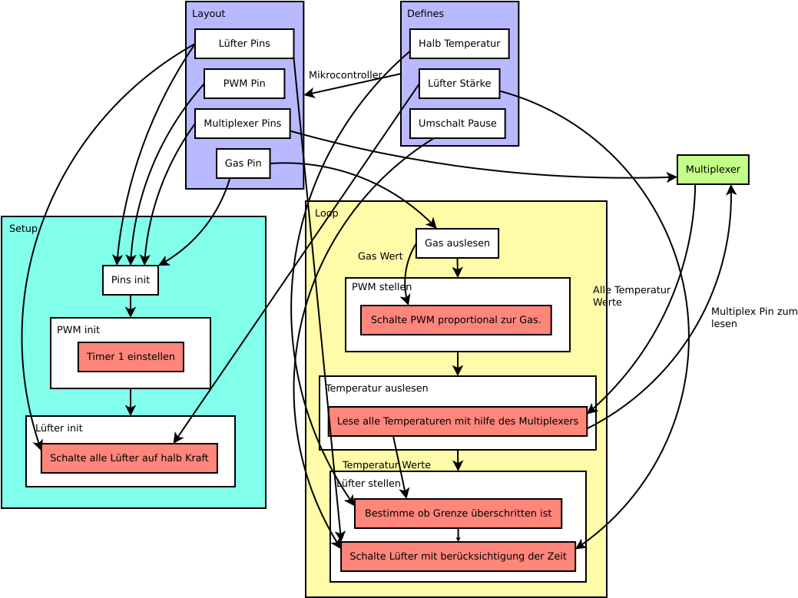

# Motorsteuerung
## Grober Übersicht

`Setup` dient zur Initialisierung des Programms und wird beim Start des Programms aufgerufen. `Loop` wird nach `Setup` aufgerufen und wird während der Programmzeit wiederholt ausgeführt. `Loop` ist für den Betrieb des Elektroautos zuständig. Die beiden Prozesse erhalten ihre Daten von `Defines` und `Layout`. `Defines` bestimmt, wie das Programm abläuft und `Layout` bestimmt, wie das Programm auf den verwendeten Mikrocontroller zugreift.

## Detaillierter Übersicht
### Defines
`Defines` wird zur Konfiguration des Programms verwendet. Es enthält die folgenden Konstanten:
|Name|Variable Name|Beschreibung|
|---|---|---|
|Halb Temperatur|FAN_HALF_POINT|Die Temperatur als Analogwert, wobei das Programm von maximaler Lüfterstufe auf halbe Lüfterstufe oder umgekehrt wechselt.|
|Lüfter Stärke|FAN_POWER|Gibt die maximale und halbe Stärke der Lüfter an.| 
|Umschalt Pause|SWITCH_LAG|Die Pause zwischen dem Umschalten auf die anderen Lüfterzustände.|

### Layout
Mit Layout wird das Layout des Mikrocontrollers festgelegt. Nach `Defines` wird der Arduino-Typ bestimmt, der das endgültige Layout festlegt. Die Pins von `Layout` werden verwendet, damit das Programm mit dem Mikrocontroller steuern kann.

### Setup
`Setup` wird beim Programmstart aufgerufen. Die folgende Komponente werden initialisiert:
- Pins: Die durch `Layout` definierten Pins werden initialisiert.
- PWM: Das Programm setzt einen Timer, um hohe PWM-Frequenzen zu erzeugen.
- Lüfter: Zu Beginn des Programms werden alle Lüfter mit `Lüfter Stärke` aktiviert.

### Loop
`Loop` wird zur Laufzeit wiederholt aufgerufen. Sie behandelt alle Eingangsschnittstellen und Ausgangsschnittstellen.

#### Gas
Der analog Signal vom Gas Potentiometer wird gelesen.

#### PWM
Mit den analogen Wert vom Gas wird der Tastgrad vom PWM bestimmt.

#### Temperatur
Die Temperaturen der einzelnen Temperatursensoren werden über einen Multiplexer ausgelesen. Das Programm geht durch alle Pins der registrierten Sensoren und liest den Analogwert.

#### Lüfter
Die Lüfter werden relativ zum Temperaturwert gesteuert. Wenn der Temperaturwert über `Halbe Temperatur` liegt, wird der Lüfter auf maximale Leistung eingestellt. Das Gegenteil geschieht, wenn der Temperaturwert unter `Halbe Temperatur` liegt. Nach der Zwischeneinstellung wartet das Programm durch die 'Schaltpause' auf den jeweiligen Lüfter.

### Übersicht
Unten werden alle oben genannte Sachen unter Visuell dargestellt.
