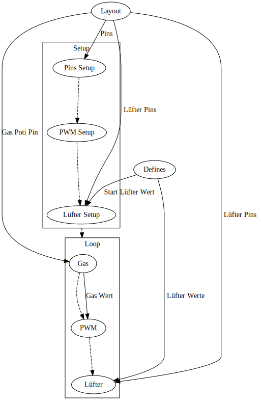

# Motorsteuerung
## Grober Übersicht

`Setup` dient zur Initialisierung des Programms und wird beim Start des Programms aufgerufen. `Loop` wird nach `Setup` aufgerufen und wird während der Programmzeit wiederholt ausgeführt. `Loop` ist für den Betrieb des Elektroautos zuständig. Die beiden Prozesse erhalten ihre Daten von `Defines` und `Layout`. `Defines` bestimmt, wie das Programm abläuft und `Layout` bestimmt, wie das Programm auf den verwendeten Mikrocontroller zugreift.

## Detaillierter Übersicht
