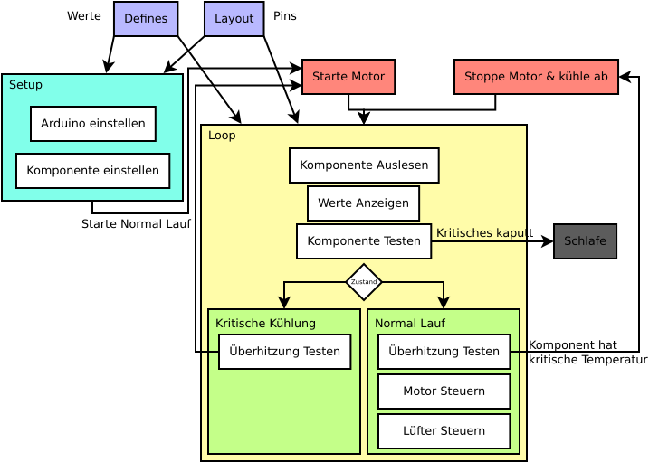

# Motorsteuerung

Das Programm ist in 2 Teile aufgeteilt:
- `Setup`: Dient zur Initialisierung des Arduino und der verschiedenen Komponenten.
- `Loop`: Dient zur Steuerung und zum Auslesen der Komponenten während der Laufzeit.

Die beiden Prozesse erhalten ihre Daten von `Defines` und `Layout`. `Defines` bestimmt, wie das Programm abläuft und `Layout` bestimmt, wie das Programm auf den verwendeten Mikrocontroller zugreift.

## Defines
`Defines` wird zur Konfiguration des Programms verwendet. Es enthält die folgenden Konstanten:
|Variable Name|Beschreibung|
|---|---|
|FAN_STATES|Die Temperatur als Analogwert, wobei das Programm zwischen verschiedenen Temperaturwerten wechselt.|
|FAN_POWER|Gibt die maximale und halbe Stärke der Lüfter an.| 
|SWITCH_LAG|Die Pause zwischen dem Umschalten auf die anderen Lüfterzustände.|
|MIN_CHARGE|Die Mindestladung in der Batterie für ein noch funktionierendes System.|

## Layout
Layout definiert das Layout und den Typ des Mikrocontrollers. Die Pins von `Layout` werden verwendet, damit das Programm den Mikrocontroller steuern kann.

## Setup
`Setup` wird beim Programmstart aufgerufen. Das Folgende wird initialisiert:
- Pins: Die durch `Layout` definierten Pins werden initialisiert.
- PWM: Das Programm setzt einen Timer, um hohe PWM-Frequenzen zu erzeugen.
- Lüfter: Zu Beginn des Programms werden alle Lüfter mit minimaler `FAN_STATES` aktiviert.

## Loop
`Loop` wird zur Laufzeit wiederholt aufgerufen. Sie behandelt alle Eingangsschnittstellen und Ausgangsschnittstellen.
- Die folgende Werte werden von den Komponenten ausgelesen.
    - Der analog Signal vom Gas Potentiometer.
    - Die analog Signale vom Temperatur Sensoren.
    - Die jetzige Ladung vom Akku.
- Bevor die Werte verarbeitet werden, werden sie an die Konsole gesendet. In Zukunft wird es eine Möglichkeit geben, sie auf einem Bildschirm zu sehen.
- Die Werte werden noch daraufhin überprüft, ob sie möglich sind. Bei unmöglichen Werten wird die jeweilige Komponente als beschädigt interpretiert und das Arduino geht schlafen.
- Das Programm kann 2 Zustände annehmen. Ein Zustand beschreibt den normalen Betrieb des Programms und der andere Zustand beschreibt den Kühlvorgang bei kritischer Temperatur.

### Normal Lauf Zustand
- Die Daten der Temperatursensoren werden mit `FAN_STATES` verglichen. Wenn eine Komponente oberhalb der kritischen Temperatur liegt, wird der Zustand auf Kühlen geändert.
- Mit den Wert vom Gas wird der Tastgrad vom Motor PWM bestimmt.
- Die Lüfterstärke pro Komponente wird relativ zur Temperatur eingestellt.

### Kühlung Zustand
- Alle Komponenten werden mit maximaler Lüftungsstärke gekühlt, bis sie nicht mehr überhitzt sind.
- Wenn die Komponenten nicht mehr überhitzt sind, wird der Zustand auf Normalbetrieb geändert.

### Temperatur
Die Temperaturen der einzelnen Temperatursensoren werden über einen Multiplexer ausgelesen. Das Programm geht durch alle Pins der registrierten Sensoren und liest den Analogwert.

### Lüfter
Die Lüfter werden relativ zum Temperaturwert gesteuert. Pro `FAN_STATES` gibt es in `FAN_POWER` die entsprechende Lüfterstärke. Nach dem Schalten gibt es eine Pause mit der Zeit `SWITCH_LAG`.